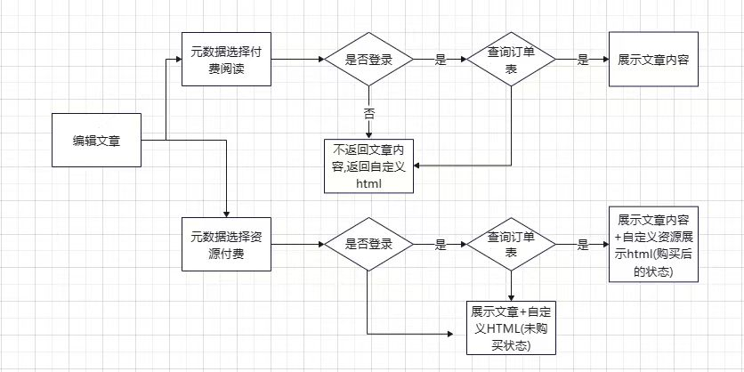
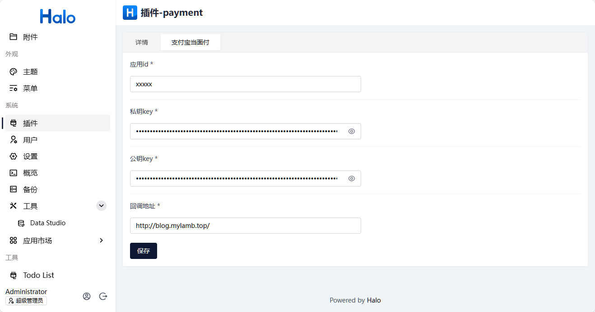
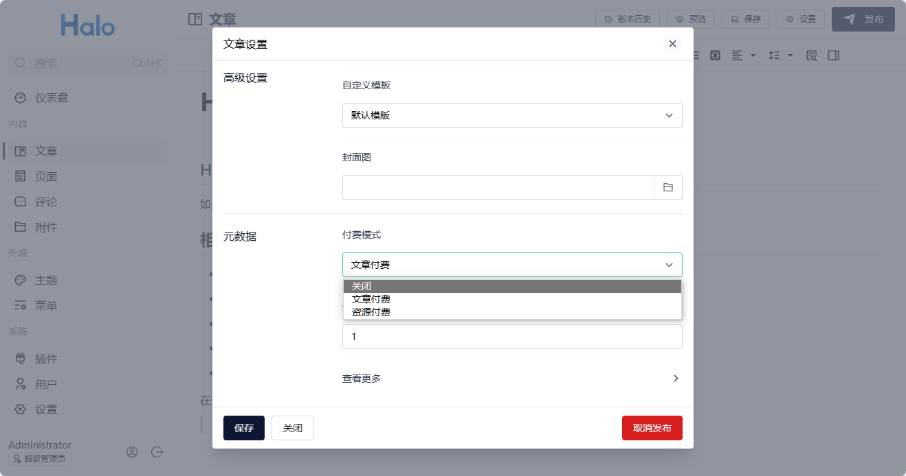

# halo-plugin-payment

一个通过添加文章元数据实现支付功能的插件

## 开发环境

插件开发的详细文档请查阅：<https://docs.halo.run/developer-guide/plugin/introduction>

所需环境：

1. Java 17
2. Node 20
3. pnpm 9
4. Docker (可选)

### 运行方式 1（推荐）

> 此方式需要本地安装 Docker

```bash
# macOS / Linux
./gradlew pnpmInstall

# Windows
./gradlew.bat pnpmInstall
```
构建 web component：
```bash
cd packages/payment-lit
pnpm i && pnpm run build
```
```bash
# macOS / Linux
./gradlew haloServer

# Windows
./gradlew.bat haloServer
```

执行此命令后，会自动创建一个 Halo 的 Docker 容器并加载当前的插件，更多文档可查阅：<https://docs.halo.run/developer-guide/plugin/basics/devtools>

### 运行方式 2

> 此方式需要使用源码运行 Halo

编译插件：

构建 web component：
```bash
cd packages/payment-lit
pnpm i && pnpm run build
```
```bash
# macOS / Linux
./gradlew build

# Windows
./gradlew.bat build
```

修改 Halo 配置文件：

```yaml
halo:
  plugin:
    runtime-mode: development
    fixedPluginPath:
      - "/path/to/halo-plugin-payment"
```

最后重启 Halo 项目即可。
# 项目流程图







# 自定义的接口请求地址

 http://localhost:8090/apis/payment.plugin.halo.run/v1alpha1/plugins/pay/trade-precreate
 http://localhost:8090/apis/payment.plugin.halo.run/v1alpha1/plugins/pay/Query-order
 http://localhost:8090/apis/payment.plugin.halo.run/v1alpha1/plugins/pay/order

# 系统生成的

http://localhost:8090/apis/payment.plugin.halo.run/v1alpha1/payments  //查询所有订单数据

其他接口请查看: https://docs.halo.run/developer-guide/plugin/api-reference/server/extension#route-rules-for-custom-apis

# 支持支付方式
## V免签
https://github.com/szvone/Vmq
payType = 'vmq_alipay || vmq_wxpay'

## 支付宝当面付
https://open.alipay.com/api/detail?code=I1080300001000041016
payType = 'alipay'